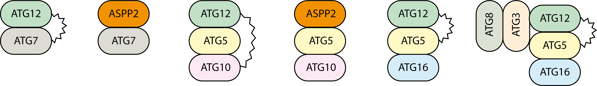
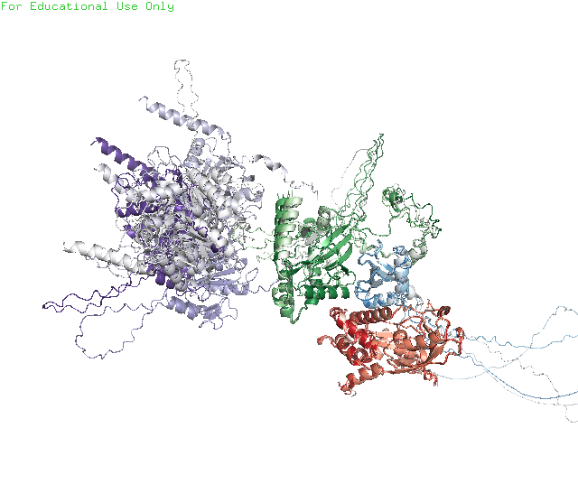
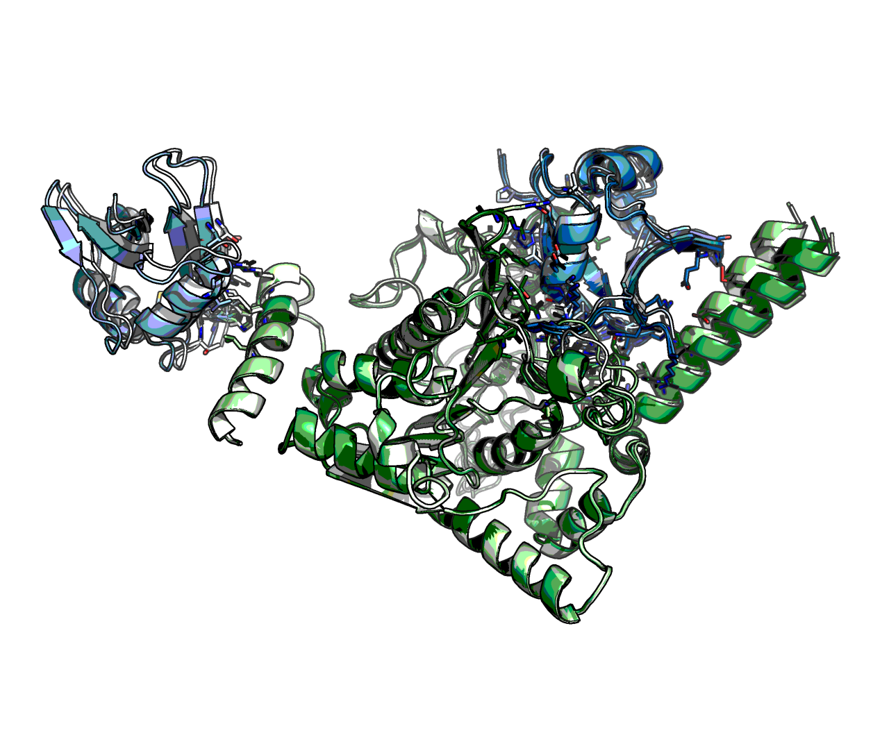
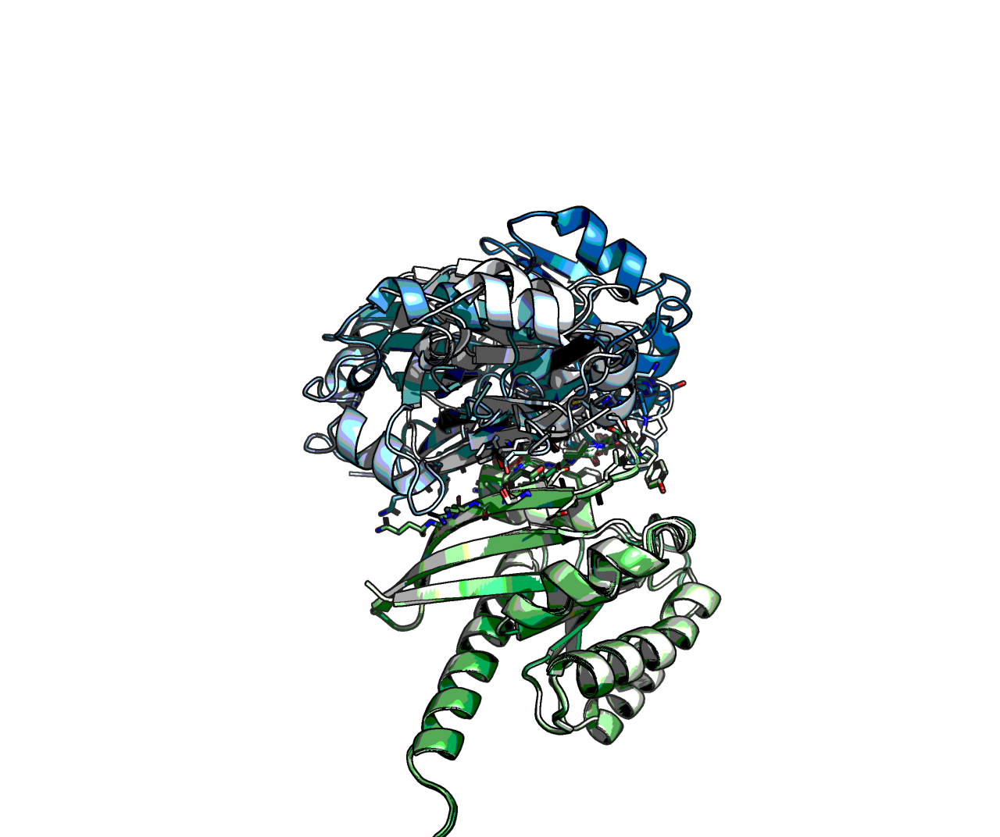
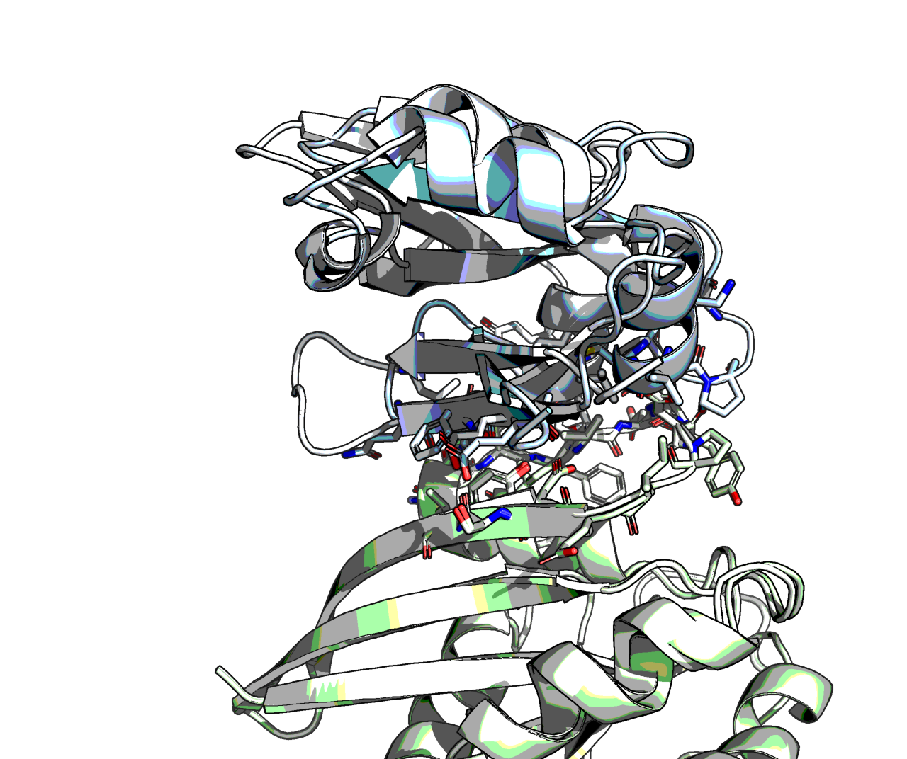

# autophagic-cell-death-complex-models
A series of models involving complexes of ATG protein and ASPP2.

This data was generated not to study the ATG proteins, but to test a hypothesis involving ASPP2 which was incorrect. Hence my public sharing. Consequently:

* Not all logical experiments were performed
* the models were not minimised for interface energy calculation
* I have not read up on the topic

## Model
The cartoons from paper are not 100% accurate. Here is a better picture:



## ATG3-ATG12-ATG5-ATG8A

ATG3 binds to ATG12 and a bit to ATG5. ATG8A to neither



## ATG5-ATG12-ATG10


## ATG7_CTD-ASPP2_NTD

ATG7 the E1 ligase is potentially bound (inhibited) by ASPP2, thus excluding ATG12




## ATG5-NTerm_ASPP2-ATG10

...

## HRas-ASPP2

This is the poorest pairing, it is consistent in location, but not in angle.



Subset:



## Image generation code

```python
jobname = '???'
num_models = 5

import pymol2, os
from matplotlib import cm
import numpy as np

from IPython.display import display, FileLink

#folder = os.path.join(os.path.expanduser('~'), 'Downloads')
folder = '.'

# 'Greys', 'Purples', 'Blues', 'Greens', 'Oranges', 'Reds'
color_maps = {
              'A': map(cm.get_cmap('Greys'), np.arange(0,1, 1/num_models)),
              'B': map(cm.get_cmap('Greens'), np.arange(0,1, 1/num_models)),
              'C': map(cm.get_cmap('Blues'), np.arange(0,1, 1/num_models)),
              'D': map(cm.get_cmap('Reds'), np.arange(0,1, 1/num_models)),
              'E': map(cm.get_cmap('Purples'), np.arange(0,1, 1/num_models)),
              'F': map(cm.get_cmap('Oranges'), np.arange(0,1, 1/num_models)),
             }

with pymol2.PyMOL() as pymol:
    top_ranked = None
    for filename in os.listdir(folder):
        if os.path.splitext(filename)[1] != '.pdb':
            continue
        match = re.match(jobname+r'_unrelaxed_rank_(?P<rank>\d)_model_(?P<model>\d+).pdb', filename)
        if not match:
            continue
        modelname = f'model{match.group("model")}'
        if int(match.group('rank')) == 1:
            top_ranked = modelname
        pymol.cmd.load(os.path.join(folder, filename), modelname)
        for chain, color_map in color_maps.items():
            pymol.cmd.color(cm.colors.to_hex(next(color_map)).replace('#', '0x'), 
                            f'{modelname} and chain {chain} and element C')
    for modelname in map('model{0}'.format, range(1, 6)):
        if modelname == top_ranked:
            continue
        pymol.cmd.align(f'{modelname} and chain B',f'{top_ranked} and chain B')
        for letter in ('B', 'C', 'D'):
            pymol.cmd.show('sticks', f'{modelname} and not chain {letter} and '+
                                     f'byresi ({modelname} and chain {letter}) around 4')
    pymol.cmd.save(f'{jobname}.pse')

# Green blue red
FileLink(f'{jobname}.pse')
```
